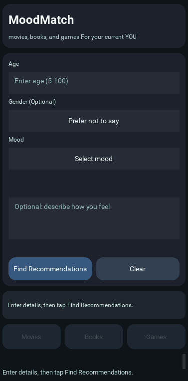
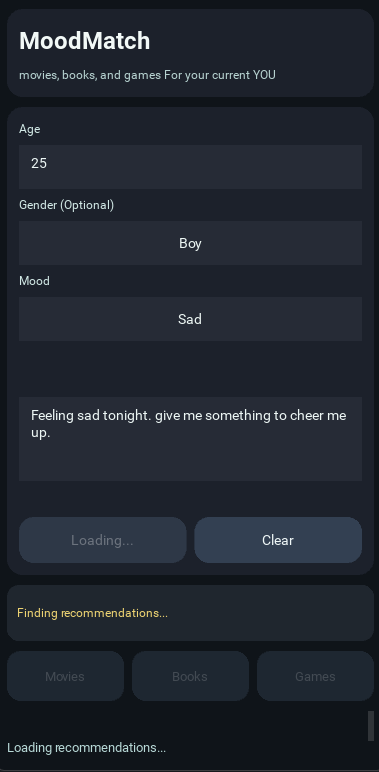
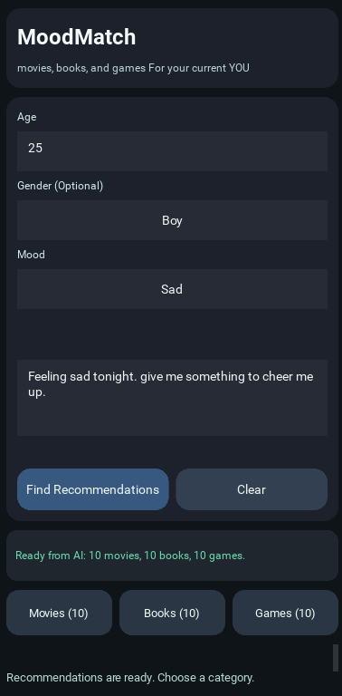
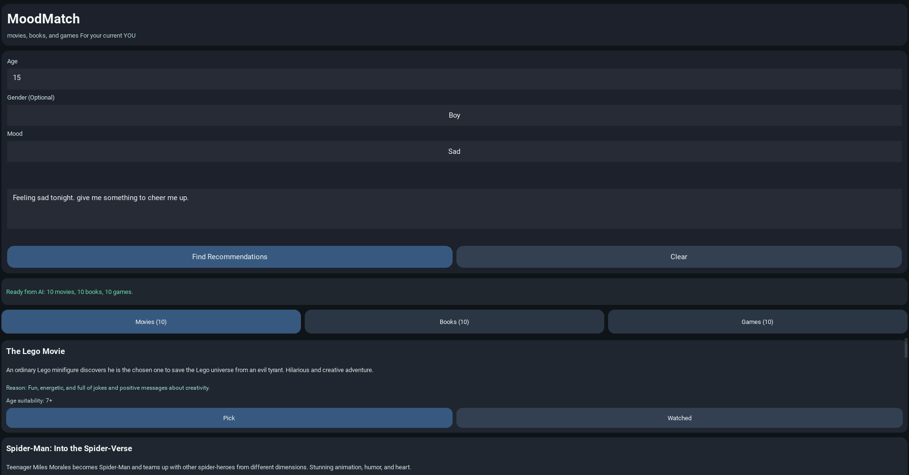
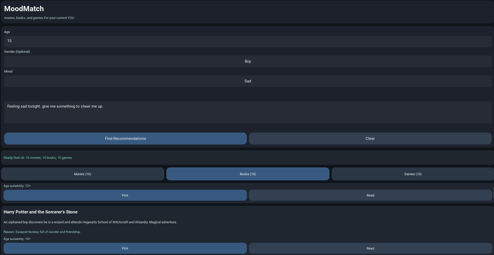
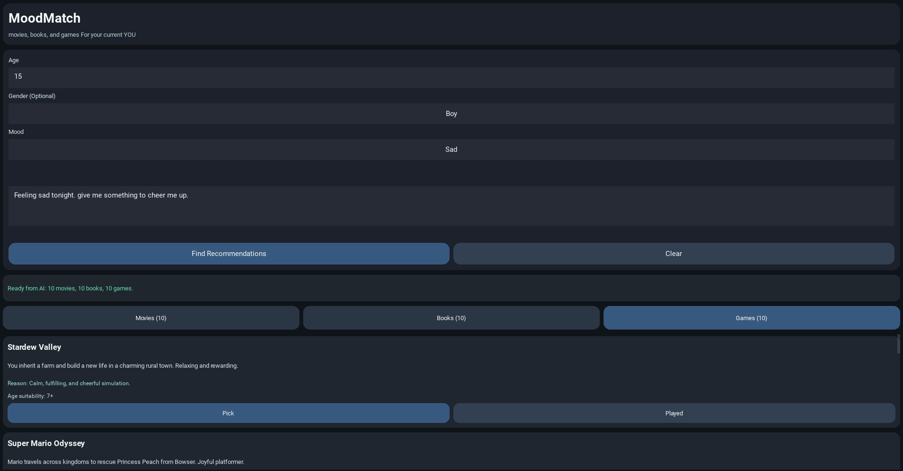
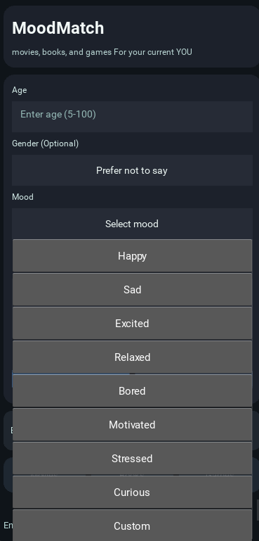

MoodMatch

MoodMatch is a small Kivy app that suggests movies, books, and games based on age, mood, and feeling with the help of ai recommendations.

## Screenshots

### Default View

### Searching State

### Found State

### Movie Options

### Book Options

### Game Options

### Mood Options

Features

- Simple form for age, gender, mood, and feeling
- AI-powered recommendations in 3 categories: movies, books, games
- Shows reasons and age suitability for each suggestion
- Basic local persistence for history/cache/state
- Clean rounded UI components for better visual consistency

Tech Stack

- Python
- Kivy
- OpenAI Python SDK (used with an OpenAI-compatible API)
- GapGPT API (`https://api.gapgpt.app/v1`)

Installation

1. Create and activate a virtual environment:
   bash
   python -m venv env
   Windows:
   env\Scripts\activate
   Linux/macOS:
   source env/bin/activate
   
2. Install dependencies:
   bash
   pip install -r requirements.txt

3. Set your API key:
   no need to add your custom api key as it is already set but if you must and need to use another provider and api key you can do this: 
   bash
   Windows PowerShell
   $env:MOODMATCH_API_KEY="your_key_here"

   

Run

bash
python main.py

Project Structure

main.py
components/        # Reusable UI widgets
screens/           # Screen layout and UI flow
services/          # AI service/client logic
storage/           # Local data persistence
utils/             # Helpers and validators
requirements.txt
buildozer.spec

Credits

- Created with help from ChatGPT GPT-5.2.
- The README and LICENSE files were expanded and refined with AI assistance.
- The `rounded-*.py` files were largely improvised with AI assistance to add rounded button styling and improve the visual appearance.
- UI colors were selected using the Windows Color Picker.
- Learning resources:
  - https://www.youtube.com/watch?v=dLgquj0c5_U&list=PLCC34OHNcOtpz7PJQ7Tv7hqFBP_xDDjqg
  - http://www.youtube.com/watch?v=l8Imtec4ReQ

License

This project is distributed under the MIT License. See the `LICENSE` file for details.
